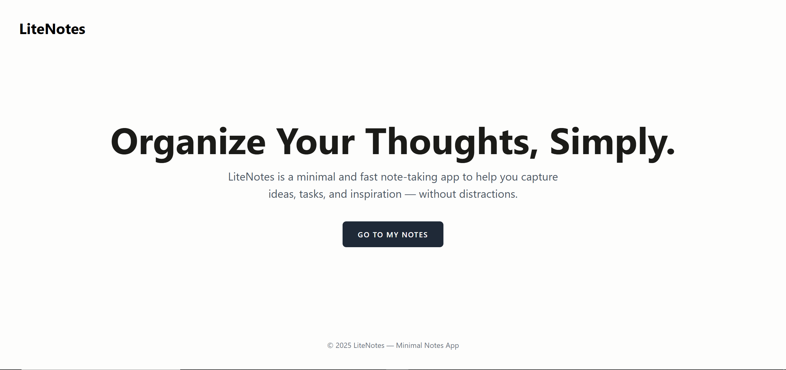

---

# LiteNotes — Simple & Fast Note-Taking App

A clean and minimal note-taking web application built with **Laravel 12**, **Blade**, **Tailwind CSS**, and **Laravel Breeze**.
This project follows the **MVC architecture** and demonstrates clean routing, controllers, models, authentication, and CRUD operations — perfect for learning or building a lightweight personal notes system.

---

## Features

*  **User Authentication** (Laravel Breeze)
*  **Create, Edit, View, and Delete Notes**
*  **Blade Components** for reusable UI
*  **Tailwind CSS** styling with a clean minimalist theme
*  **MVC Structure** (Models, Views, Controllers)
*  **Named Routes** and RESTful controllers
*  **Database Migrations & Eloquent ORM**
*  Fast development workflow with **Vite**
*  Fully responsive design

---

## Tech Stack

| Technology         | Description                |
| ------------------ | -------------------------- |
| **Laravel 12**     | Main backend framework     |
| **Blade**          | Template engine            |
| **Laravel Breeze** | Authentication scaffolding |
| **Tailwind CSS**   | Styling                    |
| **MySQL** | Database                   |
| **Eloquent ORM**   | Database interaction       |
| **PHP 8.3+**       | Required PHP version       |
| **Vite**           | Asset bundler              |

---

---
## CRUD: Notes

This app includes full CRUD functionality:

* **GET /notes** — list notes
* **GET /notes/{note}** — view note
* **POST /notes** — store new note
* **PATCH /notes/{note}** — update note
* **DELETE /notes/{note}** — delete note

All routes use **route model binding** for clean controller logic.

---

##  Authentication (Laravel Breeze)

The app uses Breeze with **Blade templates**, providing:

* Registration
* Login
* Password reset
* Email verification
* Protected routes (`auth` middleware)

---

##  Frontend

Styled with:

* Tailwind CSS
* Custom components (`<x-link-btn>`, `<x-app-layout>`, etc.)
* Clean minimal UI using rounded cards and modern spacing

## Contributing

Pull requests are welcome

